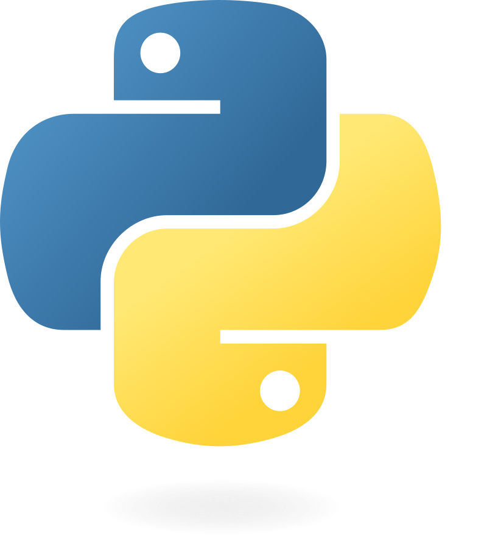

<div align="center">

# <span style="font-size: 2em;">Welcome to Python!</span>

</div>

<p align="center">
  
</p>

<div align="center">

# <span style="font-size: em;">Lets Roll!</span>

</div>

# Intrduction to Python and basics

This is a basic introduction to Python covering basics (essential for data manipulation and algorithms) from tuples to important libraries like Numpy and Pandas. This is a collection of only the basic python Libraries, but a lot more libraries exists for daily use; such as `re` for searching throough files and `OS` for Operating System integration. The ones covered here are need for any successful implimentation of a python code. 

## Features
- Contains basic python Knowledge needed for python programming. This is by no means exhaustive and only covers what I think is essential from a `data science/manipulation` perspective

## Authored
`Mark Munyi` - Rice University. `mark.munyi@rice.edu`

(Special thanks to Randy Davilla, Ph.D. for his insights and thoughts on this, as well as valuable inputs.)

### Need

Might require the following packages:

```bash
numpy
matplotlib
pandas

```
### File Structure
```bash 
.ipynb # main file with the implementation
README.md                         # This file
```

Data sets used in this series are publicly available.


